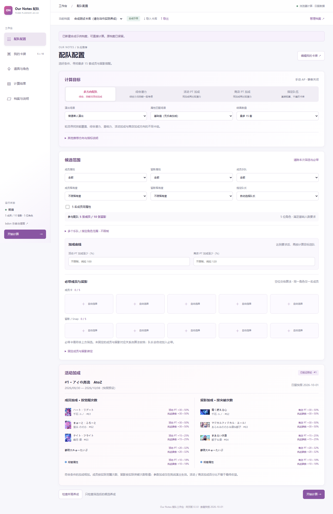

# Our Notes 配队工作台

[打开网页版](https://doublequiet-on.github.io/ournotes-team-planner-web/) · [使用说明](guides/USAGE.md) · [暂停与交接](guides/PAUSED.md)

**v0.3.0 为本轮最后一个版本，发布后暂停开发。** 数据固定在日服 **2026-10-01**、活动 ID 1；不会自动跟进新卡、新活动或游戏规则。

录入自己的成员、留影和实际养成，先设置属性、稀有度、乐队、角色范围，再寻找最多 15 套不同卡组。可指定必带卡、队长、成员与留影绑定，以及活动／商店加成底线。支持指定队伍直接验算、独立升级规划档案、队伍对比、图片和 JSON 导出。

推荐同时考虑综合力、Live 技能与留影条件。综合潜力是均匀覆盖的参考指标，**不代表任意歌曲的最高分**；多方向配队轮流优化各指标，也不是统一指标下的前 15 名。已移除歌曲选择、推荐歌曲和资源循环收益计算，歌曲与谱面请到 [bdon](https://bdon.moe/tools/chart-data) 查询。



计算在访问者的浏览器中完成，不上传个人卡库，不需要计算服务器。原网页版卡库首次打开会迁移，原记录保留；换设备或清理网站数据前请导出。计算没有候选数量或求解秒数上限，耗时取决于设备和条件，可以取消并恢复已完成的候选；只有完成证明的队伍进入缓存。

模型范围：AP/PERFECT、正生命值、辅助与撃奏关闭。普通演出不计活动参数加成，挑战计入。基础综合力不包含乐曲属性和标签；可手动指定属性匹配场景，但不选择歌曲。

## 本地构建

需要 Node.js 22+、Python 3.12；测试需要 `requirements-test.txt` 中的原生 OR-Tools。

```powershell
cd browser
npx pnpm@11.19.0 install --frozen-lockfile
npx pnpm@11.19.0 build
python -B tests/preview_server.py
```

打开 [本机预览](http://127.0.0.1:8877/ournotes-planner/)。首次下载组件较大，建议近期 Chrome／Edge；不承诺完整离线或真实手机设备性能。

- [开发与源码入口](guides/DEVELOPMENT.md)
- [算法、Worker 和缓存](guides/ARCHITECTURE.md)
- [验证方法](guides/VALIDATION.md)
- [发布及回退](guides/DEPLOYMENT.md)
- [数据来源](guides/DATA.md)、[模式规则](guides/POWER-MODES.md)、[历史性能优化](guides/PERFORMANCE.md)
- [变更记录](CHANGELOG.md)、[第三方说明](THIRD-PARTY-NOTICES.txt)、[许可证](LICENSE)

`workbench/` 是新界面和配队算法源码，`core/` 保留计分与养成模型，`browser/` 是 WASM 适配和构建，`docs/` 是生成的 Pages 网站。非官方工具；游戏数据与图片不由本项目授予版权许可。
