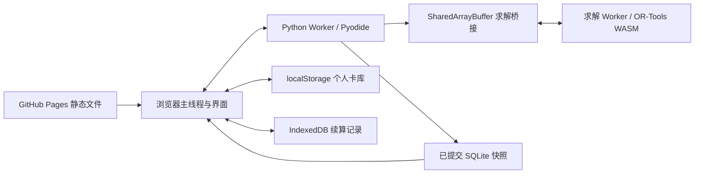

# 架构说明

网站提供 HTML、JavaScript、卡图、公开研究数据、Pyodide 和 OR-Tools WASM。浏览器载入后，主线程管理界面；Python Worker 执行原公式和完整搜索；另一求解 Worker 运行 CP-SAT。没有计算服务器、云求解账号或远程 `/api` 接口。

原界面的 `/api/bootstrap`、`/api/check-growth`、`/api/optimize` 和任务查询会被 `window.plannerFetch` 转成浏览器内 RPC。它们不会向 Pages 发送 POST 请求。任务进度与取消由主线程管理，Python 的同步搜索不会阻塞界面。

求解模型经 CP-SAT 适配器序列化，再由 Protobuf 编码。64 位整数系数、范围和解始终使用十进制字符串和 Long；禁止在传输中转成 JavaScript 浮点数。求解器先校验模型，只有 `OPTIMAL` 可以作为最优证明，`FEASIBLE` 不进入最优结果。网页版使用单个求解线程，未设置超时近似或卡池截断。

Python 在已提交步骤后发送 SQLite 快照，主线程排队将其写入 IndexedDB 事务。关闭前未完成的写入可能丢失，当前求解也会中断；下次读取最后成功保存的完整记录。存储空间不足时显示提示，计算结果仍可导出。

搜索缓存指纹包含固定模型与数据、影响结果的个人输入、浏览器 Python 适配器内容和求解版本。改变条件或适配器后不能复用旧的最优证明。损坏快照在 Worker 内被跳过，个人卡库独立保存；下一次计算写入新的有效快照。

Web Locks 限制同一项目路径同时只有一个标签页写搜索缓存。每次开始前重新读取最新 IndexedDB 快照。个人卡库另有保存值比较和 `storage` 事件保护；旧页保留导出，不能覆盖其他页的新数据。

Pages 无法由项目设置自定义隔离头，因此 Service Worker 只对其项目路径的同源静态响应加入 COOP/COEP/CORP。首次页面受控后刷新一次，启用 SharedArrayBuffer。它不缓存全部资源，本项目不据此承诺离线运行。不同项目路径使用独立的卡库、续算库、刷新标记和计算锁。

两个 Worker 的源码与原生基准不同，跨环境验收不可省略。Python Worker 异常退出会拒绝等待中的和后续 RPC，提示刷新；求解 Worker 异常会释放桥接等待并报告失败。已导出的卡库和成功保存的记录不依赖正在运行的 Worker。
